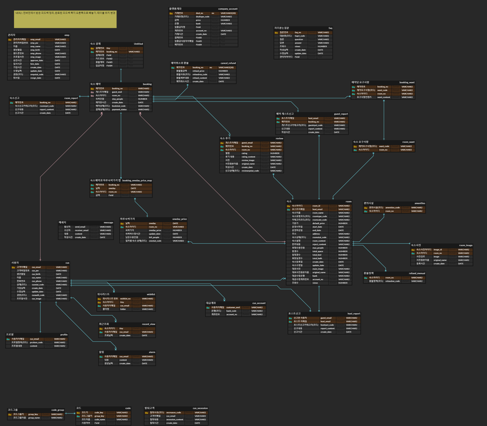

	

## 프로젝트 개요

### [프로젝트 데모](http://43.202.86.218/main) 
### ERD

	

### 문서
[와이어프레임(고객)](https://ovenapp.io/view/aT7wfVswNnJ0sZJA6qYeriJOszRL4I06#zNzbt)
 
[와이어프레임(관리자)](https://ovenapp.io/view/2WQGfuBG3JuO56hESMFsE74WR3dc9eJj#MSVmA)
 
[통합문서(WBS,  개발현황 ,메뉴구조도, 단위테스트, ERD규칙정의서)](https://docs.google.com/spreadsheets/d/1maEQi0Upb-j2Q-uGQU8IBkkwCRk44afY/edit?pli=1&gid=1798041329#gid=1798041329)
### 프로젝트 기능
- Aoom 은 사용자가 숙소를 검색하고 등록,예약할 수 있는 플랫폼을 제공합니다. 이 프로젝트는 숙소 검색, 예약 관리, 숙소등록 , 사용자 리뷰 작성 등의 기능을 포함하며, 프론트엔드와 백엔드 모두를 다루고있습니다.
### 개발기간
- 2024.06.13 ~ 2024.08.08 (8주)
### 개발 인원 및 담당기능
- 이용훈: 메인페이지 , 숙소예약기능 , 호스트 대시보드 , 호스트 예약관리  
- 오승엽: 숙소등록 및 수정 , 위시리스트기능 , 숙소수입 차트 , 숙소 캘린더
- 손지원: 예악상세 , 게스트 예약관리 , 프로필 관리 , 리뷰 작성
## 구현 기능

### 유저 등록 및 인증 
- **회원가입**
- **로그인**
- **이메일 인증**

### 게스트
- **회원 가입 및 로그인**: 사용자가 계정을 생성하고 로그인할 수 있는 기능.
- **숙소 검색**: 위치, 날짜등 조건에 맞춰 숙소를 검색할 수 있는 기능.
- **숙소 예약**: 선택한 숙소를 예약하고, 예약 내역을 조회할 수 있는 기능.
- **위시리스트**: 선호하는 숙소를 저장하고 관리할 수 있는 기능.
- **예약 상세**: 예약한 숙소의 상세 정보 및 상태를 확인할 수 있는 기능.
- **프로필 관리**: 사용자 프로필을 관리하고 업데이트할 수 있는 기능.
- **리뷰 작성**: 예약한 숙소에 대한 리뷰를 작성할 수 있는 기능.
- **메시지**: 사용자간 채팅가능한 기능.

### 호스트
- **숙소 등록 및 수정**: 새로운 숙소를 등록하고 기존 숙소 정보를 수정할 수 있는 기능.
- **호스트 대시보드**:  오늘의 일정을 확인하는 기능 , 각종 정보의 차트를 확인하는 기능.
- **호스트 예약 관리**: 예약된 숙소의 예약 내역을 관리하고 조정할 수 있는 기능.
- **숙소 수입 차트**: 숙소의 수입을 시각적으로 분석할 수 있는 차트 기능.
- **숙소 캘린더**: 숙소의 날짜별 가격 및 상태(예약 가능,예약 불가)를 설정하는 기능

### 관리자
- 

<h1>📚 STACKS</h1>

 
  
  
  ### Backend
   
  
  
  ### Frontend
   
   
   
  
  
  ### FrameWork
  
     

  ### server
   
  

  ### DB
   

  ### VersionControl
  
  
   

